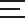

# Project -UOMO

## Lesson - 1 Initial Setup

[Project UOMO Figma Link](https://www.figma.com/design/Ee7Ax8QPZ4BBiG9lSLHINH/Uomo_Theme--Copy---Copy---Copy-?node-id=0-1&p=f&t=csAyg0VpPePIU0N9-0)

### 1. Install Vite

#### Step 1: Check Node.js

Make sure Node.js is installed:

```bash
node -v
```

If not installed, install Node.js first.

#### Step 2: Create Vite Project

Run this command:

```bash
npm create vite@latest
```

#### Step 3: Project Setup

After running, it will ask:

##### 1. Project name

```bash
✔ Project name: my-app
```

##### 2. Framework

```bash
✔ Select a framework: React
```

##### 3. Variant

```bash
✔ Select a variant: JavaScript (or TypeScript)
```

#### Step 4: Go into Project Folder

```bash
cd my-app
```

#### Step 5: Install Dependencies

```bash
npm install
```

#### Step 6: Run Development Server

```bash
npm run dev
```

#### Step 7: Open in Browser

You will see something like:

```bash
Local: http://localhost:5173/
```

Open that URL in your browser

#### 📁 Project Structure (Important)

```plaintext
Project UOMO/
 ├── public/
 ├── src/
 │    ├── assets/
 │    ├── App.jsx
 │    └── main.jsx
 ├── index.html
 ├── package.json
```

---

#### Step 8: Clean Default Code (Recommended)

##### `App.jsx`

```jsx
function App() {
  return <h1>Hello</h1>;
}

export default App;
```

### 2. Install Tailwind CSS

#### Step 1: Install Tailwind

Run:

```bash
npm install tailwindcss @tailwindcss/vite
```

#### Step 2: Configure Vite Plugin

Open `vite.config.js` and update:

```js
import { defineConfig } from 'vite'
import react from '@vitejs/plugin-react'
import tailwindcss from '@tailwindcss/vite'

export default defineConfig({
  plugins: [react(), tailwindcss()],
})
```


#### Step 3: Add Tailwind to CSS

Open your main CSS file:

usually: `src/index.css`

Replace everything with:

```css
@import "tailwindcss";
```

#### Step 4: Run Project

```bash
npm run dev
```

#### Step 5: Test Tailwind

Go to `App.jsx`:

```jsx
function App() {
  return (
    <h1 className="text-4xl text-blue-500 font-bold text-center mt-10">
      Tailwind is working.
    </h1>
  );
}

export default App;
```

#### 📁 Final Structure

```plaintext
src/
 ├── index.css   ← Tailwind here
 ├── App.jsx
 └── main.jsx
vite.config.js   ← plugin added
```

### 3. Tailwind Class Sorting with Prettier

#### Step 1: Install Required Packages

Run:

```bash
npm install -D prettier prettier-plugin-tailwindcss
```

`-D` = dev dependency (correct)

#### Step 2: Create Prettier Config File

Create a file in your root:

```plaintext
.prettierrc
```

Add this:

```json
{
  "plugins": ["prettier-plugin-tailwindcss"]
}
```

#### Step 3: (Optional but Recommended) Add Settings

Update `.prettierrc`:

```json
{
  "plugins": ["prettier-plugin-tailwindcss"],
  "semi": false,
  "singleQuote": true,
  "trailingComma": "es5"
}
```

#### Step 4: Install VS Code Extension

Install:

**Prettier – Code formatter**

(very important for auto formatting)

---

#### Step 5: Enable Auto Format in VS Code

Go to settings → search:

**Format On Save → Enable**

Or add to `settings.json`:

```json
{
  "editor.formatOnSave": true,
  "editor.defaultFormatter": "esbenp.prettier-vscode"
}
```

#### Step 6: Test It

Write messy Tailwind classes:

```jsx
<div className="text-center bg-blue-500 p-4 flex items-center justify-between text-white">
```

Save file → it becomes:

```jsx
<div className="flex items-center justify-between bg-blue-500 p-4 text-center text-white">
```

Automatically sorted

### 4. Install React Router

#### Step 1: Install React Router

Run:

```bash
npm install react-router-dom
```

### 5. File Tree

```
Project UOMO
├── 📁 markdown images
├── 📁 public
│   ├── 🖼️ favicon-16x16.png
│   ├── 🖼️ favicon.svg
│   └── 🖼️ icons.svg
├── 📁 src
│   ├── 📁 assets
│   │   ├── 🖼️ hero.png
│   │   ├── 🖼️ react.svg
│   │   └── 🖼️ vite.svg
│   ├── 📁 components
│   │   ├── 📁 common
│   │   ├── 📁 pages
│   │   │   ├── 📄 About.jsx
│   │   │   └── 📄 Home.jsx
│   │   └── 📁 ui
│   │       ├── 📄 Footer.jsx
│   │       ├── 📄 Header.jsx
│   │       ├── 📄 RootLayout.jsx
│   │       └── 📄 Test.jsx
│   ├── 🎨 App.css
│   ├── 📄 App.jsx
│   ├── 🎨 index.css
│   └── 📄 main.jsx
├── ⚙️ .gitignore
├── ⚙️ .prettierrc
├── 📝 README.md
├── 📄 eslint.config.js
├── 🌐 index.html
├── ⚙️ package-lock.json
├── ⚙️ package.json
└── 📄 vite.config.js
```

### 6. Components Config

*`main.jsx`*
```jsx
import { createRoot } from 'react-dom/client'
import './index.css'
import App from './App'

const root = createRoot(document.getElementById('root'))

root.render(
  <App/>
)

```

*`App.jsx`*
```jsx
import { createBrowserRouter } from "react-router-dom";
import { RouterProvider } from "react-router-dom";

import RootLayout from "./components/ui/RootLayout";
import Home from "./components/pages/Home";
import About from "./components/pages/About";

export default function App() {

  const router = createBrowserRouter([
    {
      path: "/",
      Component: RootLayout,
      children: [
        { index: true, Component: Home },
        { path: "about", Component: About },
      ],
    },
  ]);

  return <RouterProvider router={router} />
}
```

*`RootLayout.jsx`*
```jsx
import { Outlet } from "react-router-dom"

import Header from "./Header"
import Footer from "./Footer"
import { Test } from "../pages/Test"

export default function RootLayout() {
    return (
        <>
            <Header />
            <Outlet />
            <Footer />
            {/* <Test /> */}
        </>
    )
}
```

*`About.jsx`*
```jsx
export default function About() {
    return (
        <h1>About</h1>
    )
}
```

*`Home.jsx`*
```jsx
const Home = () => {
    return (
        <div>Home</div>
    )
}

export default Home
```

*`Header.jsx`*
```jsx
export default function Header() {
    return (
        <h1>
            Header
        </h1>
    )
}
```

*`Footer.jsx`*
```jsx
export default function Footer() {
    return (
        <h1>Footer</h1>
    )
}
```

## Lesson - 2 Header

[Project UOMO Figma Link](https://www.figma.com/design/Ee7Ax8QPZ4BBiG9lSLHINH/Uomo_Theme--Copy---Copy---Copy-?node-id=0-1&p=f&t=csAyg0VpPePIU0N9-0)

### 1. Create `images` folder with `Image.jsx`

```
├── 📁 public
│   ├── 📁 images
│   │   └── 🖼️ logo.png
│   ├── 🖼️ favicon-16x16.png
│   ├── 🖼️ favicon.svg
│   └── 🖼️ icons.svg
├── 📁 src
│   ├── 📁 assets
│   │   ├── 🖼️ hero.png
│   │   ├── 🖼️ react.svg
│   │   └── 🖼️ vite.svg
│   ├── 📁 components
│   │   ├── 📁 common
│   │   │   └── 📄 Image.jsx
```

*`Image.jsx`*
```jsx
export default function Image({ src, alt, className }) {
    return (
        
    )
}
```

### 2. Develop `Header.jsx` & `Container.jsx`

*`Container.jsx`*
```jsx
export default function Container({ children }) {
    return (
        <div className="mx-auto max-w-352.5">
            {children}
        </div>
    );
}
```

*`Header.jsx`*
```jsx
import Image from "../common/Image";
import Container from "./Container";

export default function Header() {
    return (
        <header>
            <nav>
                <Container>
                    <Image
                        src="/images/logo.png"
                        alt="Project UOMO Logo"
                    />
                </Container>
            </nav>
        </header>
    );
}
```

### 3. Create `api` folder and `navbarData.js`

#### 1. 📁 Folder Tree

```
├── 📁 src
│   ├── 📁 api
│   │   └── 📄 navbardata.js
│   ├── 📁 assets
│   │   ├── 🖼️ hero.png
│   │   ├── 🖼️ react.svg
│   │   └── 🖼️ vite.svg
│   ├── 📁 components
│   │   ├── 📁 common
│   │   │   └── 📄 Image.jsx
```

#### 2. Dynamic `menu` with optional chaining and `map()`

*`Header.jsx`*
```jsx
import { navitems } from "../../api/navbardata";

<ul>
    {
        navitems?.map((item) =>(
            <li key={item.id}>{item.name}</li>
        ))
    }
</ul>
```

*`navbarData.js`*
```js
export const navitems = [
    {
        id: 1,
        name: "HOME",
    },
    {
        id: 2,
        name: "SHOP",
    },
    {
        id: 3,
        name: "COLLECTION",
    },
    {
        id: 4,
        name: "JOURNAL",
    },
    {
        id: 5,
        name: "LOOKBOOK",
    },
    {
        id: 6,
        name: "PAGES",
    },
];
```

*Display :*


## Lesson - 3: (Class - 2)

[Project UOMO Figma Link](https://www.figma.com/design/Ee7Ax8QPZ4BBiG9lSLHINH/Uomo_Theme--Copy---Copy---Copy-?node-id=0-1&p=f&t=csAyg0VpPePIU0N9-0)

### 1. Folder Tree

```
Project UOMO
├── 📁 markdown images
│   └── 🖼️ uomo-1.png
├── 📁 public
│   ├── 📁 images
│   │   └── 🖼️ logo.png
│   ├── 🖼️ favicon-16x16.png
│   ├── 🖼️ favicon.svg
│   └── 🖼️ icons.svg
├── 📁 src
│   ├── 📁 api
│   │   └── 📄 navbardata.js
│   ├── 📁 assets
│   │   ├── 🖼️ hero.png
│   │   ├── 🖼️ react.svg
│   │   └── 🖼️ vite.svg
│   ├── 📁 components
│   │   ├── 📁 common
│   │   │   └── 📄 Image.jsx
│   │   ├── 📁 pages
│   │   │   ├── 📄 About.jsx
│   │   │   ├── 📄 Home.jsx
│   │   │   └── 📄 Test.jsx
│   │   └── 📁 ui
│   │       ├── 📄 Container.jsx
│   │       ├── 📄 Footer.jsx
│   │       ├── 📄 Header.jsx
│   │       └── 📄 RootLayout.jsx
│   ├── 🎨 App.css
│   ├── 📄 App.jsx
│   ├── 🎨 index.css
│   └── 📄 main.jsx
├── ⚙️ .gitignore
├── ⚙️ .prettierrc
├── 📝 README.md
├── 📄 eslint.config.js
├── 🌐 index.html
├── ⚙️ package-lock.json
├── ⚙️ package.json
└── 📄 vite.config.js
```

### 2. Make `layout` folder and move `RootLayout.jsx`, `Footer.jsx`, `Header.jsx`

```
│   ├── 📁 components
│   │   ├── 📁 common
│   │   │   └── 📄 Image.jsx
│   │   ├── 📁 layout
│   │   │   ├── 📄 Footer.jsx
│   │   │   ├── 📄 Header.jsx
│   │   │   └── 📄 RootLayout.jsx
│   │   ├── 📁 pages
│   │   │   ├── 📄 About.jsx
│   │   │   ├── 📄 Home.jsx
│   │   │   └── 📄 Test.jsx
│   │   └── 📁 ui
│   │       └── 📄 Container.jsx
```

### 3. `menu` Design with Font `Jost`

#### 1. Font `Jost`

*index.html*
```html
<link rel="preconnect" href="https://fonts.googleapis.com">
<link rel="preconnect" href="https://fonts.gstatic.com" crossorigin>
<link href="https://fonts.googleapis.com/css2?family=Jost:ital,wght@0,100..900;1,100..900&display=swap" rel="stylesheet">
```

*index.css*
```css
@import url('https://fonts.googleapis.com/css2?family=Jost:ital,wght@0,100..900;1,100..900&display=swap');

@theme {
    --font-jost: "Jost", sans-serif;
}
```

#### 2. menu Design

*Header.jsx*
```jsx
<header>
    <nav>
        <Container>
            <div className="
                flex
                items-center
            ">
                <Image
                    src="/images/logo.png"
                    alt="Project UOMO Logo"
                />
                <ul className="
                    ml-14
                    flex
                    gap-11
                ">
                    {
                        navitems?.map((item) => (
                            <li 
                                key={item.id}
                                className="
                                    font-jost 
                                    text-primary-black 
                                    text-sm 
                                    leading-6 
                                    font-medium
                                "
                            >{item.name}</li>
                        ))
                    }
                </ul>
            </div>
        </Container>
    </nav>
</header>
```

*Index.css*
```css
@theme {
    --font-jost: "Jost", sans-serif;
    --color-primary-black: #222;
}
```

#### 3. menu Design with TailwindCSS `hover` effect

*`Header.jsx` `<li>`*
```jsx
<li 
    key={item.id}
    className="
        font-jost 
        text-primary-black 
        after:bg-primary-black 
        relative 
        text-sm 
        leading-6 
        font-medium 
        after:absolute 
        after:bottom-0 
        after:left-0 
        after:h-px 
        after:w-0 
        after:duration-300
        after:content-['']
        hover:after:w-[40%]
    "
>{item.name}</li>
```

*`Display` :*


### 4. `Navbvar` Icons

#### 1. Navbar `Icon Button`

*Loupe*


*User*


*Shopping Bag*


*Heart*


*Nav Icon*



*`Header.jsx` `<ui>` & `<li>`*
```jsx
<header>
    <nav>
        <Container>
            <div className="
                flex
                items-center
                justify-between
            ">
                <div className="
                flex
                items-center
            ">
                    
                    <ul className="
                        ml-14
                        flex
                        gap-11
                    ">
                    </ul>
                </div>
                <ul className="
                    flex
                    items-center
                    gap-8
                ">
                    <li>
                        <button>
                            <svg></svg>
                        </button>
                    </li>
                    <li>
                        <button>
                            <svg></svg>
                        </button>
                    </li>
                    <li>
                        <button>
                            <svg></svg>
                        </button>
                    </li>
                    <li>
                        <button>
                            <svg></svg>
                        </button>
                    </li>
                    <li>
                        <button>
                            <svg></svg>
                        </button>
                    </li>
                </ul>
            </div>
        </Container>
    </nav>
</header>
```

#### 2. Bag Curt Effect

*`Header.js`*
```jsx
const cartItems = 3;

<li className="relative">
    <button>
        <svg width="21" height="20" viewBox="0 0 fill="none" xmlns="http://www.w3.org/2000/svg">
            <path d="M17.6869 4.6875H15.3021C14.05164 12.74 0 10.0174 0C7.29479 0 5.005164 4.73264 4.6875H2.3478C1.91556 4.56519 5.03727 1.56519 5.46875V19.2188C119.6502 1.91556 20 2.3478 20H17.6869C18.118.4696 19.6502 18.4696 19.2188V5.46875C15.03727 18.1192 4.6875 17.6869 4.6875ZM11.5625C11.8754 1.5625 13.4225 2.91621 13.6875H6.31332C6.61228 2.91621 8.1593 1.50174 1.5625ZM16.9043 18.4375H3.13041V69563V8.59375C4.69563 9.02523 5.046 947824 9.375C5.91047 9.375 6.26084 9.026084 8.59375V6.25H13.7739V8.59375C13.02523 14.1243 9.375 14.5565 9.375C14.988715.3391 9.02523 15.3391 8.59375V6.25H16.94375Z" fill="#222222" />
        </svg>
    </button>
    <span className="
    font-jost 
    bg-thirdcolor 
    text-primary-white 
    absolute 
    bottom-0 
    left-3 
    rounded-full 
    px-1.25 
    text-[10px] 
    font-medium
    ">
        {cartItems}
    </span>
</li>
```

*`index.css`*
```css
@theme {
    --font-jost: "Jost", sans-serif;
    --color-primary-black: #222;
    --color-primary-white: #fff;
    --color-thirdcolor: #B9A16B;
}

.u-list {
    @apply
        ml-14
        flex
        gap-11
}

.list-item {
    @apply
        font-jost 
        text-primary-black 
        after:bg-primary-black 
        relative 
        text-sm 
        leading-6 
        font-medium 
        after:absolute 
        after:bottom-0 
        after:left-0 
        after:h-0.5 
        after:w-0 
        after:duration-300
        after:content-['']
        hover:after:w-[40%]
}
```

*Display :*


### 5. `Header.jsx` Repositioning

*`Header.jsx`*
```jsx
<header className="
    mt-7.25
    mb-4.75
">
<Container />
</header>
```

*Display*


### 6. Banner Section

#### Lesson - 1: Make `home` folder inside `components` then create `Banner.jsx`

*`File Tree`*
```
Project UOMO
│   ├── 📁 components
│   │   ├── 📁 common
│   │   │   └── 📄 Image.jsx
│   │   ├── 📁 home
│   │   │   └── 📄 Banner.jsx
│   │   ├── 📁 layout
│   │   │   ├── 📄 Footer.jsx
│   │   │   ├── 📄 Header.jsx
│   │   │   └── 📄 RootLayout.jsx
│   │   ├── 📁 pages
│   │   │   ├── 📄 About.jsx
│   │   │   ├── 📄 Home.jsx
│   │   │   └── 📄 Test.jsx
│   │   └── 📁 ui
│   │       └── 📄 Container.jsx
```

*`Banner.jsx`*
```jsx
const Banner = () => {
    return (
        <div>Banner</div>
    )
}

export default Banner
```

*`Home.jsx`*
```jsx
import Banner from "../home/Banner"

const Home = () => {
    return (
        <Banner />
    )
}

export default Home
```

#### Lesson - 2: Banner Image

##### Make `images` folder and insert banner image

*`File Tree`*
```
├── 📁 src
│   ├── 📁 api
│   │   └── 📄 navbardata.js
│   ├── 📁 assets
│   │   ├── 📁 images
│   │   │   └── 🖼️ banner.png
│   │   ├── 🖼️ hero.png
│   │   ├── 🖼️ react.svg
│   │   └── 🖼️ vite.svg
```

*`Banner,jsx`*
```jsx
import Image from "../common/Image"
import BannerImage from "../../assets/images/banner.png"

const Banner = () => {
    return (
        <>
            <Image src={BannerImage} />
        </>
    )
}

export default Banner
```

##### Make `bannerdata.js` API inside api folder

*File Tree*
```
├── 📁 src
│   ├── 📁 api
│   │   ├── 📄 bannerdata.js
│   │   └── 📄 navbardata.js
```

*`bannerdata.js`*
```js
import BannerImage from "../assets/images/banner.png"

export const BannerData = [
    {
        id: 1,
        banner: BannerImage,
    },
    {
        id: 2,
        banner: BannerImage,
    },
    {
        id: 3,
        banner: BannerImage,
    },
    {
        id: 4,
        banner: BannerImage,
    },
]
```

##### Use map() to exract banner image from `bannerdata.js`

*`Banner.jsx`*
```jsx
import Image from "../common/Image"
import { BannerData } from "../../api/bannerdata"

const Banner = () => {
    return (
        <div>
            {
                BannerData?.map((item) => (
                    <Image key={item.id} src={item.banner} />
                ))
            }
        </div>
    )
}

export default Banner
```

#### Lesson - 3: REACT Slick

1st,
```bash
npm install react-slick --save
```

2nd,
```bas
npm install slick-carousel --save
```

3rd,
*`Banner.jsx`*
```jsx
import Image from "../common/Image"
import { BannerData } from "../../api/bannerdata"
import SliderImport from "react-slick";
import "slick-carousel/slick/slick.css";

const Slider = SliderImport.default || SliderImport;

const Banner = () => {

    const settings = {
        dots: true,
        infinite: true,
        speed: 500,
        slidesToShow: 1,
        slidesToScroll: 1,
    };

    return (
        <div>
            <Slider {...settings}>
                {
                    BannerData?.map((item) => (
                        <Image key={item.id} src={item.banner} />
                    ))
                }
            </Slider>
        </div>
    )
}

export default Banner
```

### 7. React Slick Slider Design

*`Banner.jsx`*
```jsx
import Image from "../common/Image"
import { BannerData } from "../../api/bannerdata"
import SliderImport from "react-slick";
import "slick-carousel/slick/slick.css";

const Slider = SliderImport.default || SliderImport;

const Banner = () => {

    const settings = {
        dots: true,
        arrows: false,
        infinite: true,
        speed: 500,
        slidesToShow: 1,
        slidesToScroll: 1,
        appendDots: dots => (
            <div>
                <ul
                    className="
                        flex 
                        gap-5 
                        absolute
                        bottom-14.5
                        left-48.75
                    "
                    style={{ margin: "0px" }}
                >
                    {" "}{dots}{" "}
                </ul>
            </div>
        ),
        customPaging: () => (
            <div
                className="
                    bg-[#ddc2b9]
                    h-1.5
                    w-1.5
                    rounded-full
                "
            >
            </div>
        )
    };

    return (
        <div className="
            mx-15
        ">
            <Slider {...settings}>
                {
                    BannerData?.map((item) => (
                        <Image
                            className="
                                w-full
                                text-center
                            "
                            key={item.id}
                            src={item.banner}
                        />
                    ))
                }
            </Slider>
        </div>
    )
}

export default Banner
```

*`index.css`*
```css
.slick-dots .slick-active {
    @apply
        border-primary-black
        flex
        h-7.5
        w-7.5
        items-center
        justify-center
        rounded-full
        border
}

.slick-dots ul {
    @apply
        flex
        items-center
        justify-center
}

.slick-active div {
    @apply
        bg-primary-black;
}
```

*Display*


#### 8.